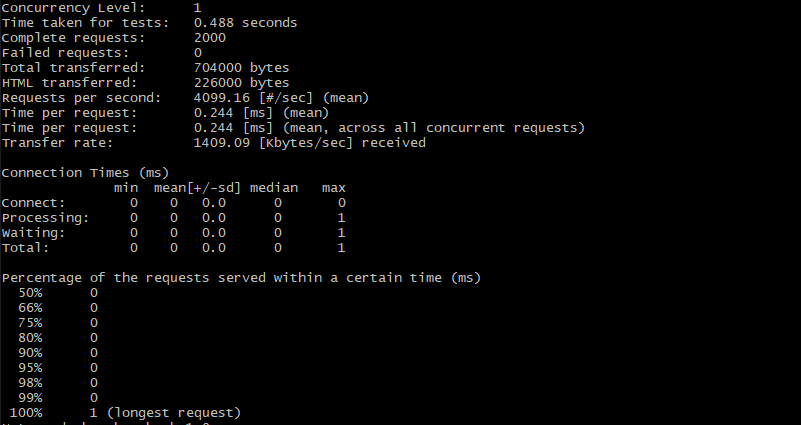
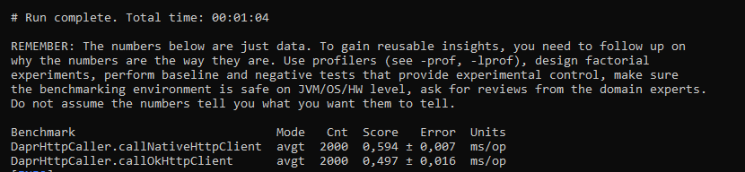

# Benchmark for OkHttp and Java HTTP Client

This benchmark repository provides methods for benchmarking the [OkHttp Client](https://github.com/square/okhttp) and [Java HTTP Client](https://openjdk.java.net/groups/net/httpclient/intro.html) (introduced in Java 11) in a [dapr-java-sdk](https://github.com/dapr/java-sdk) environment.

The [DaprHttp](https://github.com/dapr/java-sdk/blob/a654861defaed64d64bd2110c48c241d13317878/sdk/src/main/java/io/dapr/client/DaprHttp.java#L36) class from the dapr-java-sdk is turned into a simplified interface. For both clients, an equal implementation of this interface has been made to get a fair comparison. [JMH](https://github.com/openjdk/jmh) (Java Microbenchmark Harness) uses both implementations for performance testing.

Both HTTP clients send their requests to an Nginx webserver that serves a static JSON response. [ApacheBench](https://httpd.apache.org/docs/2.4/programs/ab.html) (also provided in this repository) can be used to performance test this Nginx Webserver, to get an idea of how fast the webserver can go. The result of the ApacheBench test can be used as baseline measurement for the comparison of the results of the HTTP clients performance tests.

All measurements will be shown in milliseconds per operation (ms/op). Keep in mind that the results of the benchmarks depend on the environment you run the benchmarks in. That's why ApacheBench is also provided in this repository, to get a baseline measurement before running JMH.

# How to run 

## Prerequisites

Make sure you have the following prerequisites installed on your machine.

- Docker for Desktop
- Java 11 or above
- Apache Maven 3.6.3 or above

## Instructions

In order to run everything in the right way and get good measurements, you can follow the following steps:

### 1. Run the Nginx webserver in a Docker container
To send HTTP requests to the webserver, you first have to start the Nginx webserver that serves a static JSON response in a Docker container. You can execute the `run_nginx.sh` shell script in the `infrastructure/nginx` folder to start the webserver.

The static JSON response will be served at `http://localhost:4005/employees.json`

### 2. Run ApacheBench from a Docker container
When the Nginx webserver is running you can performance test the webserver using ApacheBench to get a baseline measurement. To do this you can execute the `run_apache_bench.sh` shell script in the `infrastructure/ab` folder.

### 3. Run JMH for OkHttp Client and Java HTTP Client
To run JMH for the OkHttp Client an Java HTTP client you can execute the following command in the root of the repository
```
mvn clean compile exec:java
```
You can also run the `nl.julian.benchmark.BenchMarkRunner` mainClass from your IDE (IntelliJ).

### 4. Compare the results
After running the ApacheBench benchmark and JMH benchmarks you can compare the measurements.

# Result example

## ApacheBench


## JMH
